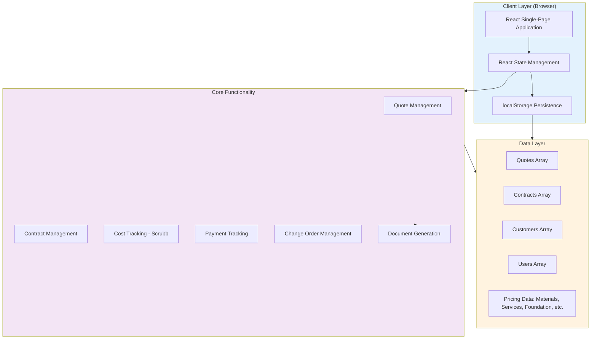
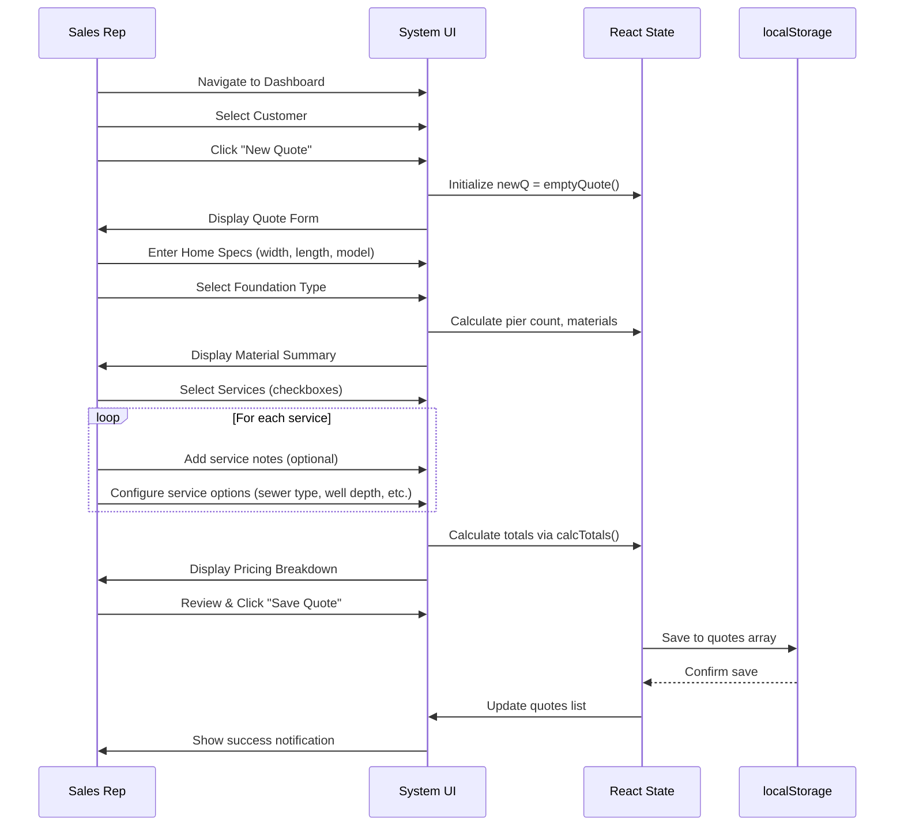
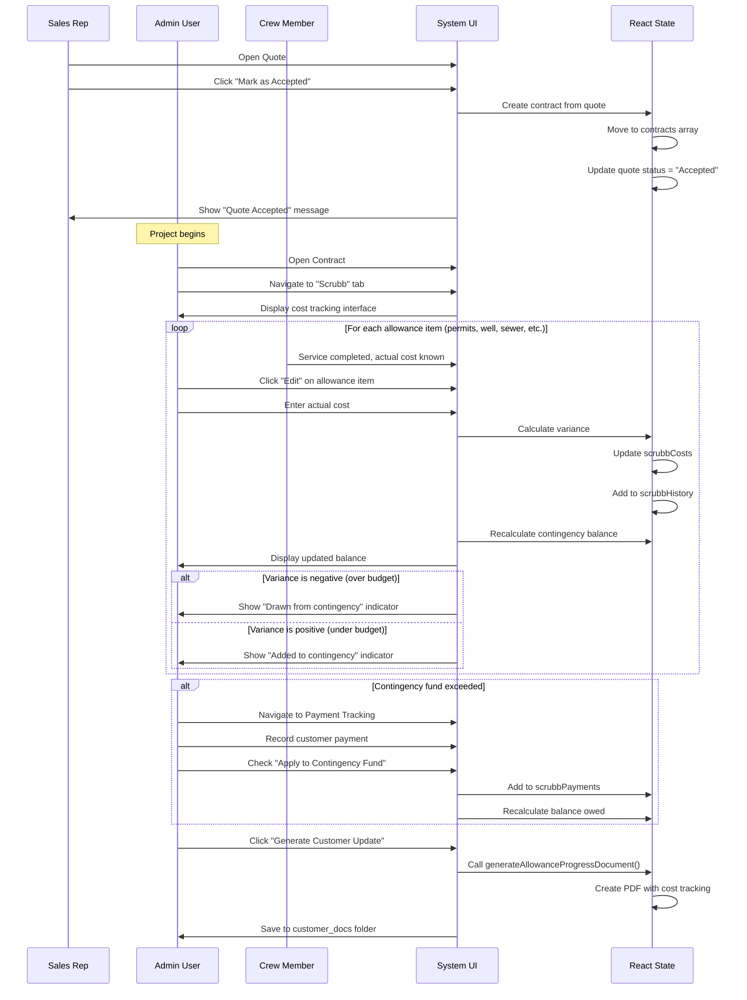
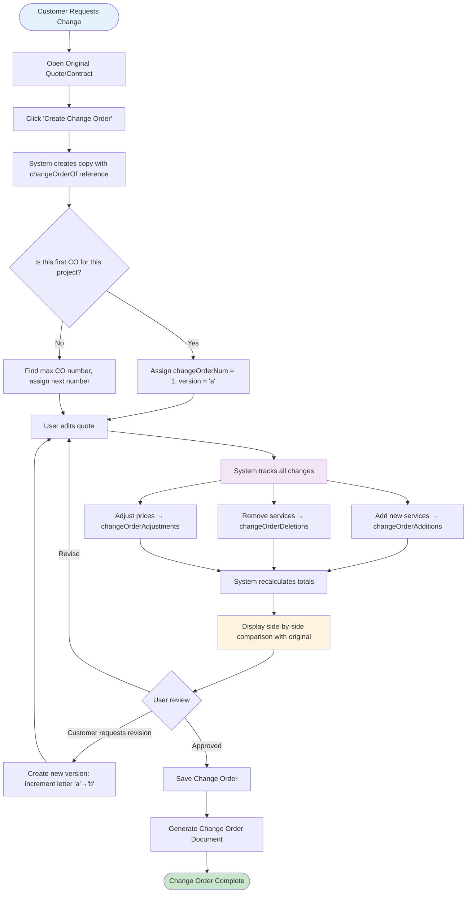

# Sherman Bidding System - Technical Specification

## Executive Summary

The Sherman Bidding System is a comprehensive web-based application for managing manufactured home installation quotes, contracts, and project execution for Sherman Lumber Inc. The system eliminates traditional construction loan complexity by providing a unified platform for quote generation, contract management, cost tracking (through "Scrubb" functionality), payment tracking, and document generation.

The application operates as a **single-page React application** with localStorage persistence, supporting multiple user roles (Admin, Sales, Crew) and handling the complete lifecycle from initial customer contact through project completion. Key differentiators include:

- **Integrated cost tracking** ("Scrubb" page) for allowance-based items with real-time contingency fund management
- **Change order management** with version tracking and side-by-side comparison
- **Payment tracking system** separating regular project payments from contingency fund payments
- **Automated document generation** for customer quotes, scope of work, material lists, and progress updates
- **File management system** organized by folder type (customer docs, crew files, permits, etc.)

Market positioning: Sherman Lumber operates in the manufactured home installation sector, where projects typically range from $50,000-$250,000+ and involve coordination of multiple services (site prep, foundation, installation, utilities, etc.). The system addresses the specific pain points of allowance-based pricing (permits, wells, sewer, etc.) and contingency fund management unique to this industry.

## Definitions and System Architecture

### Core Concepts

**Quote** - An estimate for manufactured home installation services, including materials, labor, services, and pricing. Quotes have statuses: Draft, Sent, Accepted, Declined. When accepted, a quote becomes a contract.

**Contract** - An accepted quote that has been signed/accepted by the customer. Contracts are stored separately from quotes and unlock additional functionality (Scrubb page, payment tracking, contract-specific documents).

**Change Order** - A modification to an existing quote that creates a new version with tracked changes (additions, deletions, adjustments). Change orders reference the original quote via `changeOrderOf` field and maintain version tracking (`changeOrderNum`, `changeOrderVersion`).

**Scrubb** - The cost tracking interface for contracts where estimated allowance costs are replaced with actual costs as they are incurred. Allowance items include: permits, well installation, sewer connection, sand pad, crane rental, gravel driveway.

**Contingency Fund** - A 2% buffer fund included in all quotes to cover allowance overages and unexpected costs. The fund calculation follows:
```
Current Balance = Starting Contingency (2% of project)
                + Allowance Savings (items under budget)
                - Allowance Overages (items over budget)
                - Contingency Payments (customer payments toward overages)
```

**Allowance Items** - Services with variable costs that are estimated in quotes but finalized during construction. Distinguished from fixed-cost services by the `ALLOWANCE_ITEMS` constant: `['permits', 'gravel_driveway', 'sand_pad', 'sewer', 'well', 'crane']`.

### User Roles and Permissions

| Role | Capabilities | Restrictions |
|------|-------------|--------------|
| **Admin** | Full system access; create/edit users, customers, quotes, contracts; access all documents; modify pricing | None |
| **Sales** | Create/edit quotes; manage customers; view contracts; generate customer-facing documents | Cannot modify pricing; cannot access crew-only files |
| **Crew** | View assigned contracts; update Scrubb costs; upload files to crew folders; view technical documents | Cannot create quotes; cannot modify pricing; limited customer data access |

Role switching: Admins can temporarily switch to Sales or Crew view to test permissions.

### System Architecture



## Feature Catalog

### Quote Management Features

| Feature | Description | User Roles | Key Functions |
|---------|-------------|------------|---------------|
| **Quote Creation** | Generate new installation quotes with customizable services, materials, and pricing | Admin, Sales | `emptyQuote()`, `saveNew()` |
| **Quote Editing** | Modify existing draft quotes | Admin, Sales | `setEditingQuoteId()`, quote state updates |
| **Quote Status Management** | Track quote lifecycle: Draft → Sent → Accepted/Declined | Admin, Sales | Status field updates, `acceptQuote()` |
| **Quote Duplication** | Create copy of existing quote for similar projects | Admin, Sales | Deep copy with new ID |
| **Quote Search** | Search quotes by customer name, address, quote number | Admin, Sales | `searchQuery` filter |
| **Quote Filtering** | Filter by status, date range, assigned user | Admin, Sales | Array filter functions |

### Contract Management Features

| Feature | Description | User Roles | Key Functions |
|---------|-------------|------------|---------------|
| **Contract Creation** | Convert accepted quote to contract | Admin, Sales | `acceptQuote()` - moves to contracts array |
| **Contract Viewing** | View contract details, documents, and status | Admin, Sales, Crew | `setSelContract()` |
| **Scrubb Cost Tracking** | Update estimated costs with actual costs for allowances | Admin, Crew | Scrubb tab interface, `scrubbCosts` updates |
| **Scrubb History** | Track all cost updates with timestamps and user attribution | Admin, Crew | `scrubbHistory` array |
| **Payment Tracking** | Record project payments (regular & contingency fund) | Admin | `scrubbPayments` array |
| **File Management** | Upload/organize project files by folder type | Admin, Sales, Crew (limited) | `addFileToFolder()`, folder structure |

### Change Order Management

| Feature | Description | User Roles | Implementation |
|---------|-------------|------------|----------------|
| **Change Order Creation** | Create versioned modification to existing quote/contract | Admin, Sales | `changeOrderOf` reference, version tracking |
| **Version Tracking** | Track multiple revisions (1a, 1b, 2a, etc.) | Admin, Sales | `changeOrderNum`, `changeOrderVersion` |
| **Side-by-Side Comparison** | Visual diff showing original vs. change order | Admin, Sales | `originalQuoteForComparison` state |
| **Change Tracking** | Track additions, deletions, and price adjustments | Admin, Sales | `changeOrderDeletions`, `changeOrderAdjustments`, `changeOrderAdditions` |
| **Change Order Documents** | Generate customer-facing change order PDFs | Admin, Sales | `generateChangeOrderDocument()` |

### Document Generation

| Document Type | Purpose | Generated For | Key Function |
|---------------|---------|---------------|--------------|
| **Customer Quote** | Professional quote presentation with pricing breakdown | Quotes | `generateCustomerQuote()` |
| **Scope of Work** | Detailed service descriptions and expectations | Quotes, Contracts | `generateScopeOfWorkDocument()` |
| **Material List** | Itemized materials for pier foundation | Contracts | `generateMaterialList()` |
| **Pier Layout** | Visual diagram of pier placement | Contracts | `generatePierLayoutDocument()` |
| **Customer Info Sheet** | Contact and site information for crew | Contracts | `generateCustomerInfoDocument()` |
| **Decor Checklist** | Home specifications for ordering | Contracts | `generateDecorChecklistDocument()` |
| **Change Order** | Versioned change documentation with diff | Change Orders | `generateChangeOrderDocument()` |
| **Allowance Progress Update** | Customer-facing cost tracking report | Contracts (from Scrubb) | `generateAllowanceProgressDocument()` |

### Pricing and Calculations

| Component | Calculation Basis | Configurable By | Default Values |
|-----------|------------------|-----------------|----------------|
| **Home Models** | Predefined size/price combinations | Admin (via pricing tab) | Width × Length with base pricing |
| **Materials** | Cost per square foot or per unit | Admin | Lumber, piers, beams, insulation, etc. |
| **Services** | Fixed price or calculated (e.g., drive time) | Admin | Site prep, installation, crane, utilities |
| **Foundation Pricing** | Type-based (slab, crawl, basement) | Admin | Per foundation type |
| **Sewer/Well Pricing** | Connection type or depth-based | Admin | Septic, city sewer, well depth tiers |
| **Patio Pricing** | Size-based tiers | Admin | Small, medium, large, extra-large |
| **Drive Time** | Mileage-based with different rates | Admin | Install, service, project command, inspection |
| **Contingency** | 2% of total project cost | System-calculated | Auto-calculated, non-editable |

## Data Models

### Quote Object Schema

```javascript
{
  // Identity
  id: string,                          // Unique identifier (genId())
  quoteType: string,                   // 'modular_home' (others planned)
  status: 'Draft' | 'Sent' | 'Accepted' | 'Declined',

  // Customer Reference
  customerId: string,                  // Foreign key to customers array

  // Home Specifications
  homeModel: string,                   // e.g., "Aiden 56x28"
  houseWidth: number,                  // feet
  houseLength: number,                 // feet
  singleDouble: 'Single' | 'Double',

  // Foundation
  foundationType: 'slab' | 'crawl' | 'basement',
  iBeamHeight: number,                 // inches (optional, calculated)
  pierCount: number,                   // calculated
  beamCount: number,                   // calculated

  // Services
  selectedServices: {
    [serviceKey: string]: boolean      // e.g., { site_prep: true, installation_of_home: true }
  },
  serviceNotes: {
    [serviceKey: string]: string       // Customer-facing notes per service
  },
  serviceCrewNotes: {
    [serviceKey: string]: string       // Internal crew notes per service
  },

  // Service-Specific Details
  sewerType: 'septic' | 'city' | null,
  wellDepth: '0-100' | '101-200' | '201-300' | '301-400' | '400+' | null,
  patioSize: 'small' | 'medium' | 'large' | 'xlarge' | null,
  customServices: Array<{
    description: string,
    price: number
  }>,

  // Scope of Work
  customScopeContent: {
    [sectionKey: string]: string       // Custom content for scope sections
  },

  // Change Orders
  changeOrderOf: string | null,        // ID of original quote if this is a CO
  changeOrderNum: number | null,       // 1, 2, 3, etc.
  changeOrderVersion: string | null,   // 'a', 'b', 'c', etc.
  changeOrderDeletions: Array<string>, // Service keys marked as deleted
  changeOrderAdjustments: {
    [serviceKey: string]: {
      amount: number,
      reason: string
    }
  },
  changeOrderAdditions: Array<{       // New services added in CO
    key: string,
    name: string,
    price: number,
    notes: string
  }>,

  // Cost Tracking (Scrubb)
  scrubbCosts: {
    [serviceKey: string]: number       // Actual costs for allowance items
  },
  scrubbHistory: Array<{
    id: string,
    serviceKey: string,
    serviceName: string,
    contractPrice: number,
    newCost: number,
    variance: number,                  // contractPrice - newCost
    isAllowance: boolean,
    updatedAt: string,                 // ISO date
    updatedBy: string                  // User name
  }>,
  scrubbDocs: {
    [serviceKey: string]: Array<File>  // Supporting documents per service
  },

  // Payment Tracking
  scrubbPayments: Array<{
    id: string,
    amount: number,
    date: string,                      // ISO date (YYYY-MM-DD)
    notes: string,
    isContingencyPayment: boolean,     // true if applying to contingency fund
    createdAt: string,                 // ISO timestamp
    createdBy: string                  // User name
  }>,

  // File Management
  folders: {
    customer_docs: Array<File>,
    crew_files: Array<File>,
    permits: Array<File>,
    photos: Array<File>,
    change_orders: Array<File>,
    warranty: Array<File>,
    inspections: Array<File>,
    clayton_docs: Array<File>
  },

  // Metadata
  createdAt: string,                   // ISO timestamp
  createdBy: string,                   // User name
  updatedAt: number,                   // Timestamp
  updatedBy: string,                   // User name
  assignedTo: string | null            // User name for crew assignments
}
```

### Customer Object Schema

```javascript
{
  // Identity
  id: string,

  // Contact Information
  firstName: string,
  lastName: string,
  email: string,
  phone: string,
  secondaryContact: {
    name: string,
    phone: string,
    email: string
  } | null,

  // Site Address
  siteAddress: string,
  siteCity: string,
  siteState: string,
  siteZip: string,

  // Mailing Address (if different)
  mailingAddress: string | null,
  mailingCity: string | null,
  mailingState: string | null,
  mailingZip: string | null,

  // Notes
  notes: string,

  // Metadata
  createdAt: string,
  createdBy: string
}
```

### User Object Schema

```javascript
{
  // Identity
  username: string,                    // Unique login
  fullName: string,

  // Authentication
  password: string,                    // In production: hashed

  // Profile
  role: 'admin' | 'sales' | 'crew',
  company: string,
  phone: string,

  // Metadata
  createdAt: string
}
```

### File Object Schema

```javascript
{
  name: string,                        // Filename with extension
  type: string,                        // Folder category key
  url: string,                         // Data URL (base64) or external URL
  notes: string,                       // User notes about the file
  addedBy: string,                     // User name
  addedAt: string                      // ISO timestamp
}
```

## Business Logic and Calculations

### Total Cost Calculation (calcTotals Function)

The `calcTotals()` function is the core financial calculation engine. It computes all pricing components and returns a structured totals object.

```javascript
Input: (quote, materials, services, sewerPricing, patioPricing, driveRates, foundationPricing)

Output: {
  // Materials
  mat: Array<{ name, qty, cost, unit }>,
  matTotal: number,

  // Services
  svc: Array<{ key, name, cost, isAllowance }>,
  svcTotal: number,

  // Component Totals
  subtotal: number,                    // matTotal + svcTotal
  tax: number,                         // subtotal * 0.07 (7% sales tax)
  contingency: number,                 // subtotal * 0.02 (2% contingency)
  totalWithContingency: number,        // subtotal + tax + contingency

  // Allowance Breakdown
  allowanceEstimate: number,           // Sum of allowance item estimates
  nonAllowanceTotal: number            // Sum of fixed-cost items
}
```

#### Calculation Steps:

1. **Materials Calculation**
   - Calculate square footage: `width * length`
   - For each material: `quantity = sqft * ratePerSqft` or fixed quantity
   - Material total = sum of all material costs

2. **Services Calculation**
   - For each selected service:
     - If allowance item: use estimate from service definition
     - If custom service: use provided price
     - If drive time: calculate based on mileage and rate
     - If size-based (patio, sewer, well): lookup tier pricing

3. **Tax Calculation**
   - Tax = (matTotal + svcTotal) * 0.07
   - Tax rate is hardcoded (7%) - should be configurable by state

4. **Contingency Calculation**
   - Contingency = (matTotal + svcTotal) * 0.02
   - Always 2% of subtotal (before tax)

5. **Final Total**
   - Total = subtotal + tax + contingency

### Contingency Fund Balance Calculation

**Three separate calculations** must stay synchronized:

#### 1. Scrubb Page - Contingency Fund Tracker
```javascript
const startingContingency = totals.contingency || 0;

const allowanceSavings = trackingItems
  .filter(item => ALLOWANCE_ITEMS.includes(item.key) && item.variance > 0)
  .reduce((sum, item) => sum + item.variance, 0);

const allowanceOverages = trackingItems
  .filter(item => ALLOWANCE_ITEMS.includes(item.key) && item.variance < 0)
  .reduce((sum, item) => sum + Math.abs(item.variance), 0);

const payments = currentItem.scrubbPayments || [];
const contingencyPaymentsApplied = payments
  .filter(p => p.isContingencyPayment)
  .reduce((sum, p) => sum + parseFloat(p.amount || 0), 0);

const currentBalance = startingContingency
                     + allowanceSavings
                     - allowanceOverages
                     - contingencyPaymentsApplied;
```

#### 2. Scrubb Page - Payment Tracking Section
```javascript
const allowanceSavings = (currentItem.scrubbHistory || [])
  .filter(e => e.isAllowance && e.variance > 0)
  .reduce((sum, e) => sum + e.variance, 0);

const allowanceOverages = (currentItem.scrubbHistory || [])
  .filter(e => e.isAllowance && e.variance < 0)
  .reduce((sum, e) => sum + Math.abs(e.variance), 0);

const amountExceeded = Math.max(0, allowanceOverages - (startingContingency + allowanceSavings));

const payments = currentItem.scrubbPayments || [];
const contingencyPayments = payments
  .filter(p => p.isContingencyPayment)
  .reduce((sum, p) => sum + parseFloat(p.amount || 0), 0);

const currentBalance = startingContingency
                     + allowanceSavings
                     - allowanceOverages
                     - contingencyPayments;

const remainingBalance = amountExceeded - contingencyPayments;
```

#### 3. Customer Document - Allowance Progress Update
```javascript
const startingContingency = totals.contingency;

const allowanceSavings = allowanceItems
  .filter(item => item.variance > 0)
  .reduce((sum, item) => sum + item.variance, 0);

const allowanceOverages = allowanceItems
  .filter(item => item.variance < 0)
  .reduce((sum, item) => sum + Math.abs(item.variance), 0);

const allPayments = quote.scrubbPayments || [];
const contingencyPaymentsTotal = allPayments
  .filter(p => p.isContingencyPayment)
  .reduce((sum, p) => sum + parseFloat(p.amount || 0), 0);

const currentBalance = startingContingency
                     + allowanceSavings
                     - allowanceOverages
                     - contingencyPaymentsTotal;
```

**Critical Requirement:** All three formulas MUST produce identical results for the same data.

### Variance Calculation (Scrubb)

When actual costs are entered for allowance items:

```javascript
variance = contractPrice - actualCost

// Examples:
// Permits estimated at $5,000, actual $4,200 → variance = +$800 (savings)
// Well estimated at $8,000, actual $12,000 → variance = -$4,000 (overage)
```

**Important:** Variance is stored in `scrubbHistory` with:
- Positive variance = under budget = added to contingency fund
- Negative variance = over budget = drawn from contingency fund
- Zero variance = on budget = no impact

## Regulatory and Compliance Considerations

### Data Privacy and Storage

**Current Implementation:** All data stored in browser localStorage (unencrypted).

**Risks:**
- No encryption at rest
- Accessible via browser dev tools
- No backup/disaster recovery
- No audit trail for data access
- Violates data protection best practices

**Recommendations:**
- Implement server-side database with encryption
- Add user authentication/authorization
- Implement role-based access control (RBAC)
- Add audit logging for all data changes
- Implement automatic backups

### Document Retention

**Current Implementation:** Documents stored as base64 data URLs in localStorage.

**Issues:**
- No formal retention policy
- No secure deletion mechanism
- Limited storage capacity (localStorage ~5-10MB limit)
- No version control for documents

**Recommendations:**
- Define document retention policy (e.g., 7 years for contracts)
- Implement cloud storage (S3, Azure Blob, etc.)
- Add document versioning
- Implement secure deletion with audit trail

### Financial Compliance

**Tax Calculation:**
- Currently hardcoded at 7%
- Should be configurable by state/jurisdiction
- Should support tax-exempt customers
- Should generate tax reports for accounting

**Payment Tracking:**
- No integration with accounting software
- Manual reconciliation required
- No payment receipt generation
- No refund tracking

### Accessibility Compliance

**Current State:** No accessibility features implemented.

**Requirements:**
- WCAG 2.1 Level AA compliance
- Keyboard navigation support
- Screen reader compatibility
- Color contrast requirements
- Form label associations

## Use Cases and Documented Flows

### Use Case 1: Creating a New Quote (Sales Role)

**Actors:** Sales representative, Customer

**Preconditions:**
- Sales user is logged in
- Customer information has been entered into system

**Main Flow:**



**Postconditions:**
- Quote saved with status "Draft"
- Quote appears in customer's quote list
- Materials and services calculated
- Quote ID generated

**Alternative Flows:**
- **2a. Customer not found:** Prompt to create customer first
- **5a. Required fields missing:** Display validation errors
- **7a. Save fails:** Display error, allow retry

### Use Case 2: Converting Quote to Contract and Tracking Costs

**Actors:** Sales representative, Admin, Crew

**Preconditions:**
- Quote exists with status "Draft" or "Sent"
- Customer has accepted quote (verbal or signed)

**Main Flow:**



**Postconditions:**
- Contract created in contracts array
- Original quote status = "Accepted"
- Scrubb costs tracked with history
- Contingency balance updated
- Customer update document generated

**Business Rules:**
- Only allowance items (ALLOWANCE_ITEMS array) can be tracked in Scrubb
- Variance calculation: contractPrice - actualCost
- Positive variance adds to contingency fund
- Negative variance draws from contingency fund
- Payments marked as "contingency" reduce balance owed
- Regular payments tracked separately, don't affect contingency

### Use Case 3: Creating and Managing Change Orders

**Actors:** Sales representative or Admin

**Preconditions:**
- Quote or contract exists
- Customer requests modification to scope

**Main Flow:**



**Postconditions:**
- Change order saved as new quote with tracking fields
- Original quote remains unchanged
- Change tracking arrays populated
- Change order document generated
- Total cost reflects all changes

**Change Order Numbering Examples:**
- Original quote: Quote #12345
- First change order: CO #1a
- Revision to first CO: CO #1b
- Second change order: CO #2a
- Revision to second: CO #2b

### Use Case 4: File Management Across Roles

**Actors:** Admin, Sales, Crew

**Preconditions:**
- Contract exists
- User has appropriate role permissions

**File Upload Flow:**

```javascript
// User selects file via drag-drop or file input
async function handleFileUpload(file, folderType, contract) {
  // 1. Validate file
  if (!validateFile(file)) {
    throw new Error('Invalid file type or size');
  }

  // 2. Convert to data URL
  const dataUrl = await blobToDataUrl(file);

  // 3. Create file object
  const fileObject = {
    name: file.name,
    type: folderType,
    url: dataUrl,
    notes: '',  // User can add later
    addedBy: currentUser.fullName,
    addedAt: new Date().toISOString()
  };

  // 4. Add to appropriate folder
  const updatedContract = {
    ...contract,
    folders: {
      ...contract.folders,
      [folderType]: [...contract.folders[folderType], fileObject]
    }
  };

  // 5. Save to contracts array
  saveContracts(updatedContracts);
}
```

**Folder Access Permissions:**

| Folder | Admin | Sales | Crew |
|--------|-------|-------|------|
| customer_docs | R/W | R/W | R |
| crew_files | R/W | R | R/W |
| permits | R/W | R/W | R |
| photos | R/W | R/W | R/W |
| change_orders | R/W | R/W | R |
| warranty | R/W | R/W | R |
| inspections | R/W | R | R/W |
| clayton_docs | R/W | R/W | R |

*R = Read, W = Write*

## Implementation Details and Technical Specifications

### Technology Stack

**Frontend:**
- React 18 (via CDN: unpkg.com/react@18)
- Babel Standalone (for JSX transformation in browser)
- No build process (runs directly in browser)

**State Management:**
- React useState hooks
- No Redux/MobX (all state in component)

**Data Persistence:**
- localStorage (browser-based)
- JSON serialization
- No backend server
- No database

**Styling:**
- Inline styles (CSS-in-JS)
- No CSS framework
- Custom components

**Utilities:**
- Custom utility modules (see below)

### Utility Modules (src/sherman-bidding-system.jsx)

#### blobToDataUrl
```javascript
/**
 * Converts a Blob/File to a data URL for storage
 * @param {Blob} blob - File or Blob object
 * @param {string} context - Description for error messages
 * @returns {Promise<string>} Data URL
 */
```
**Usage:** File uploads, document generation
**Replaces:** 15+ duplicate FileReader patterns

#### createStateSaver
```javascript
/**
 * Creates a function to save data to localStorage
 * @param {string} key - localStorage key
 * @param {Function} setter - React setState function
 * @returns {Function} Save function
 */
```
**Usage:** `saveQuotes`, `saveContracts`, `saveCustomers`, `saveUsers`
**Replaces:** 4 duplicate state saver functions

#### NotificationSystem
```javascript
/**
 * Display user notifications
 * @methods success(message), error(message), warning(message), info(message)
 */
```
**Usage:** 40+ scattered alert() calls
**Features:** Consistent emoji indicators, better UX

#### DocumentUtils
```javascript
/**
 * Utility functions for document generation
 */
{
  formatDate: (date?) => string,           // Consistent date formatting
  getQuoteNum: (quote) => string,          // Extract quote number
  getHomeDesc: (quote) => string,          // Generate home description
  getBaseStyles: () => string,             // Shared CSS for documents
  filterServices: (services, selected) => Array  // Filter selected services
}
```
**Usage:** All document generation functions
**Replaces:** 15+ duplicate patterns

#### Validators
```javascript
/**
 * Form validation utilities
 */
{
  required: (value) => string|null,        // Empty value check
  email: (value, existing) => string|null, // Email + duplicate check
  phone: (value, existing) => string|null, // Phone + duplicate check
  fileSize: (file, maxMB) => string|null   // File size validation
}
```
**Usage:** User creation, file uploads, form validation

#### CalcHelpers
```javascript
/**
 * Calculation helper utilities
 */
{
  calculateQuoteTotals: (quote, customer, ...) => totals,  // Main calculation
  getBeamHeight: (quote) => number                         // I-beam calculation
}
```
**Usage:** 20+ calcTotals() calls
**Benefit:** Eliminates object spreading `{...quote, ...customer}`

#### FolderUtils
```javascript
/**
 * File and folder utilities
 */
{
  getFolders: () => object,                    // Initialize folder structure
  createFileObject: (name, type, url, notes, user) => object  // Create file
}
```
**Usage:** 3 folder initializations, 10+ file creations

#### TestHelpers
```javascript
/**
 * Testing and debugging utilities
 */
{
  createMockQuote: (overrides) => quote,       // Generate test quote
  createMockCustomer: (overrides) => customer, // Generate test customer
  logState: (name, state) => void,             // Debug state
  measureTime: (fn, label) => result,          // Performance profiling
  validateQuote: (quote) => errors             // Data validation
}
```
**Usage:** Testing, debugging, development

### Performance Optimization

**React.useMemo for Calculations:**
```javascript
const totals = React.useMemo(() => {
  if (view === 'newQuote' && selCustomer && newQ.houseWidth && newQ.houseLength) {
    return CalcHelpers.calculateQuoteTotals(
      newQ, selCustomer, materials, services,
      sewerPricing, patioPricing, driveRates, foundationPricing
    );
  }
  if (view === 'viewQuote' && quoteWithCust) {
    return calcTotals(
      quoteWithCust, materials, services,
      sewerPricing, patioPricing, driveRates, foundationPricing
    );
  }
  return null;
}, [view, newQ, selCustomer, quoteWithCust, materials, services,
    sewerPricing, patioPricing, driveRates, foundationPricing]);
```
**Benefit:** Prevents expensive recalculation on every render

### Error Handling

**ErrorBoundary Component:**
```javascript
class ErrorBoundary extends React.Component {
  state = { hasError: false, error: null, errorInfo: null }

  static getDerivedStateFromError(error) {
    return { hasError: true };
  }

  componentDidCatch(error, errorInfo) {
    this.setState({ error, errorInfo });
    console.error('ErrorBoundary caught:', error, errorInfo);
  }

  render() {
    if (this.state.hasError) {
      return <UserFriendlyErrorUI />;
    }
    return this.props.children;
  }
}

// Usage: Wraps entire app
export default function App() {
  return (
    <ErrorBoundary>
      <AppInner />
    </ErrorBoundary>
  );
}
```
**Benefit:** Prevents white screen crashes, shows user-friendly error messages

### Build Process

**Current (Browser-Based):**
```html
<!-- Modular-Bidding.html structure -->
<!DOCTYPE html>
<html>
<head>
  <!-- React & ReactDOM from CDN -->
  <script src="https://unpkg.com/react@18/umd/react.production.min.js"></script>
  <script src="https://unpkg.com/react-dom@18/umd/react-dom.production.min.js"></script>

  <!-- Babel for JSX transformation -->
  <script src="https://unpkg.com/@babel/standalone/babel.min.js"></script>
</head>
<body>
  <div id="root"></div>

  <script type="text/babel">
    // Storage adapter
    window.storage = {
      async get(key) { /* localStorage.getItem */ },
      async set(key, value) { /* localStorage.setItem */ }
    };

    // Application code from sherman-bidding-system.jsx
    // (injected by convert-jsx-to-html.ps1)

    // Render
    ReactDOM.render(<App />, document.getElementById('root'));
  </script>
</body>
</html>
```

**Build Script (convert-jsx-to-html.ps1):**
```powershell
# 1. Read JSX source
$jsxContent = Get-Content "src\sherman-bidding-system.jsx" -Raw

# 2. Replace imports with destructuring
$jsxContent = $jsxContent -replace "import React, { useState, useEffect } from 'react';", "const { useState, useEffect } = React;"

# 3. Inject into HTML template
$htmlTemplate = @"
<!DOCTYPE html>
<html>
  <!-- head with CDN scripts -->
  <body>
    <div id="root"></div>
    <script type="text/babel">
      window.storage = { /* ... */ };
      $jsxContent
      ReactDOM.render(<App />, document.getElementById('root'));
    </script>
  </body>
</html>
"@

# 4. Write output
[System.IO.File]::WriteAllText("Modular-Bidding.html", $htmlTemplate, [System.Text.Encoding]::UTF8)
```

### File Size and Performance Metrics

**Current File Sizes:**
- sherman-bidding-system.jsx: ~750 KB
- Modular-Bidding.html: ~751 KB
- Difference: +1 KB (HTML wrapper overhead)

**localStorage Usage:**
- Quotes: Variable (depends on # of quotes)
- Contracts: Variable (depends on # of contracts)
- Customers: ~10-50 KB typical
- Users: ~1-5 KB
- Files (base64): Major contributor to storage use
- **Total typical usage:** 2-5 MB
- **localStorage limit:** 5-10 MB (browser-dependent)

**Performance Characteristics:**
- Initial load: ~500-1000ms (CDN script loading)
- Render time: ~100-300ms (React render)
- Calculate totals: ~10-50ms (depends on quote complexity)
- Save to localStorage: ~50-200ms (depends on data size)
- Generate document: ~200-500ms (HTML string construction)

## Migration Path and Modernization Recommendations

### Phase 1: Backend Integration (Priority: High)

**Current State:** All data in localStorage
**Target State:** Server-side database with API

**Steps:**
1. Set up Node.js/Express backend
2. Implement PostgreSQL or MongoDB database
3. Create REST API endpoints:
   - `/api/quotes` (CRUD)
   - `/api/contracts` (CRUD)
   - `/api/customers` (CRUD)
   - `/api/users` (CRUD + auth)
   - `/api/files` (upload/download)
4. Implement authentication (JWT)
5. Add authorization/RBAC
6. Migrate data from localStorage to database

**Benefits:**
- Multi-user access
- Data persistence
- Backup/recovery
- Audit trail
- Role-based access control

### Phase 2: Build Process (Priority: Medium)

**Current State:** Browser-based Babel transpilation
**Target State:** Webpack/Vite build process

**Steps:**
1. Initialize npm project
2. Set up Vite or Create React App
3. Move from CDN React to npm packages
4. Implement ES modules
5. Add TypeScript (recommended)
6. Set up hot module replacement (HMR)

**Benefits:**
- Faster development
- Type safety (with TypeScript)
- Tree shaking (smaller bundle)
- Code splitting
- Better debugging

### Phase 3: Cloud File Storage (Priority: High)

**Current State:** Base64 in localStorage
**Target State:** Cloud storage (S3/Azure Blob)

**Steps:**
1. Set up AWS S3 or Azure Blob Storage
2. Implement file upload API
3. Generate signed URLs for downloads
4. Implement file versioning
5. Add virus scanning
6. Implement retention policies

**Benefits:**
- Unlimited file storage
- Better security
- Virus scanning
- CDN delivery
- Automatic backups

### Phase 4: UI Framework (Priority: Low)

**Current State:** Custom inline styles
**Target State:** Component library (Material-UI, Ant Design, or Tailwind)

**Steps:**
1. Choose UI framework
2. Install dependencies
3. Refactor components gradually
4. Implement consistent design system
5. Add responsive design
6. Improve accessibility

**Benefits:**
- Consistent UI/UX
- Accessibility built-in
- Responsive by default
- Faster development
- Professional appearance

### Phase 5: Testing (Priority: Medium)

**Current State:** No automated tests
**Target State:** Unit, integration, and E2E tests

**Steps:**
1. Set up Jest for unit tests
2. Set up React Testing Library
3. Write tests for utility functions
4. Write tests for components
5. Set up Cypress for E2E tests
6. Add CI/CD with test automation

**Benefits:**
- Prevent regressions
- Faster development
- Confident refactoring
- Documentation via tests

## Appendix: Constants and Configuration

### Allowance Items
```javascript
const ALLOWANCE_ITEMS = [
  'permits',
  'gravel_driveway',
  'sand_pad',
  'sewer',
  'well',
  'crane'
];
```

### Default Tax Rate
```javascript
const TAX_RATE = 0.07;  // 7%
```

### Default Contingency Rate
```javascript
const CONTINGENCY_RATE = 0.02;  // 2%
```

### Drive Rates (per mile)
```javascript
const DRIVE_RATE_INSTALL = 2.50;
const DRIVE_RATE_SERVICE = 2.00;
const DRIVE_RATE_PC = 1.50;  // Project Command
const DRIVE_RATE_INSPECTION = 1.25;
```

### Folder Types
```javascript
const FOLDER_TYPES = [
  'customer_docs',
  'crew_files',
  'permits',
  'photos',
  'change_orders',
  'warranty',
  'inspections',
  'clayton_docs'
];
```

### Quote Statuses
```javascript
const QUOTE_STATUSES = [
  'Draft',
  'Sent',
  'Accepted',
  'Declined'
];
```

### User Roles
```javascript
const USER_ROLES = [
  'admin',
  'sales',
  'crew'
];
```

---

*This specification document represents the current state of the Sherman Bidding System as of February 2026. For implementation questions or clarification, refer to the source code in `src/sherman-bidding-system.jsx`.*
