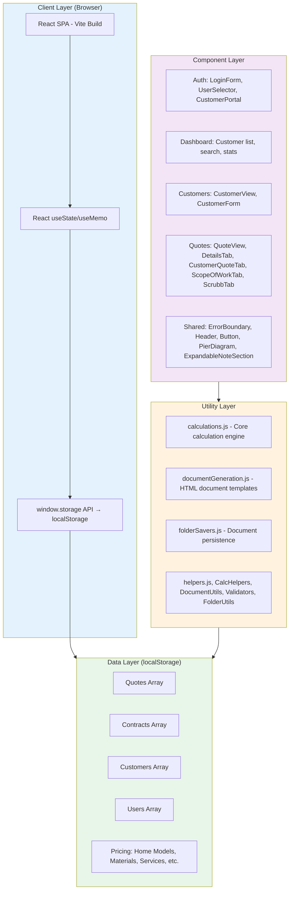
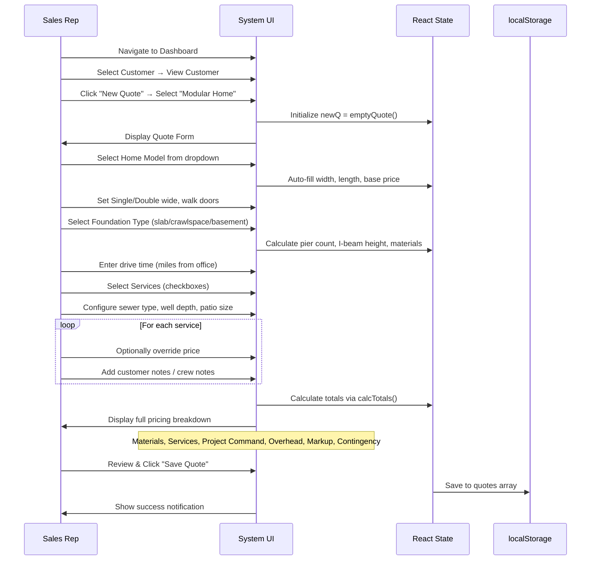
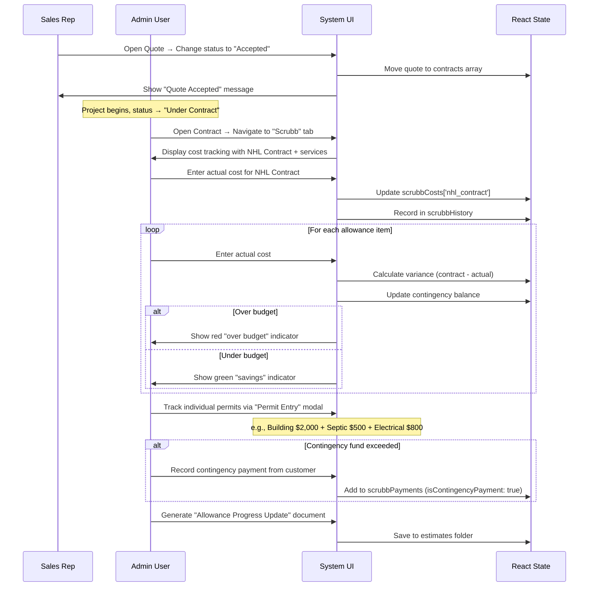
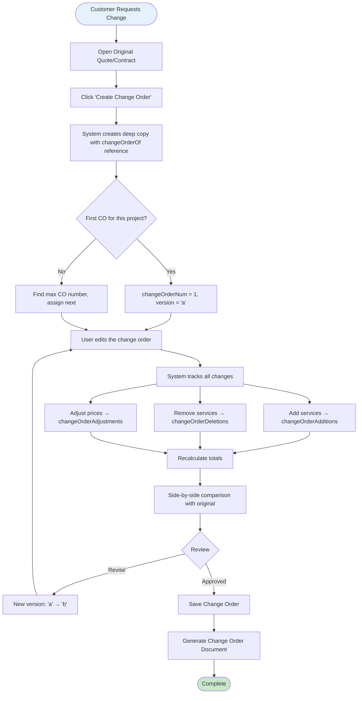

# Sherman Bidding System - Technical Specification

## Executive Summary

The Sherman Bidding System is a comprehensive web-based application for managing manufactured home installation quotes, contracts, and project execution for Sherman Pole Buildings (Sherman Lumber Inc.). The system eliminates traditional construction loan complexity by providing a unified platform for quote generation, contract management, cost tracking (through "Scrubb" functionality), payment tracking, and document generation.

The application operates as a **single-page React application** built with Vite, using localStorage persistence and supporting multiple user roles (Admin, Sales, Crew) plus a Customer Portal. It handles the complete lifecycle from initial customer contact through project completion. Key differentiators include:

- **Integrated cost tracking** ("Scrubb" page) for allowance-based items with real-time contingency fund management
- **NHL Contract grouping** — Materials, Installation, and Painting are lumped into a single "NHL Contract" line item for Scrubb tracking
- **Change order management** with version tracking and side-by-side comparison
- **Payment tracking system** separating regular project payments from contingency fund payments
- **Automated document generation** for customer quotes, scope of work, crew work orders, pier diagrams, and progress updates
- **Project Command cost calculations** (Project Supervisor, Project Manager, Project Coordinator)
- **Customer Portal** for customers to view their quotes, active jobs, and published notes
- **File management system** organized by folder type (estimates, crew files, permits, etc.)
- **Configurable pricing** with admin-editable home models, services, materials, and drive rates

Market positioning: Sherman Pole Buildings operates in the manufactured home installation sector, where projects typically range from $50,000-$250,000+ and involve coordination of multiple services (site prep, foundation, installation, utilities, etc.). The system addresses the specific pain points of allowance-based pricing (permits, wells, sewer, etc.) and contingency fund management unique to this industry.

---

## Definitions and System Architecture

### Core Concepts

**Quote** — An estimate for manufactured home installation services, including home price, materials, labor, services, overhead, markup, and contingency. Quotes have statuses: Draft, Sent, Accepted, Declined. When accepted, a quote becomes a contract.

**Contract** — An accepted quote that has been moved to the contracts array. Contracts have statuses: Accepted, Under Contract, Completed, Cancelled. Contracts unlock additional functionality (Scrubb page, payment tracking, contract-specific documents).

**Change Order** — A modification to an existing quote that creates a new version with tracked changes (additions, deletions, adjustments). Change orders reference the original quote via `changeOrderOf` field and maintain version tracking (`changeOrderNum`, `changeOrderVersion`).

**Scrubb** — The cost tracking interface for contracts where estimated costs are replaced with actual costs as the project progresses. The Scrubb tab groups related items: the **NHL Contract** (Materials + Installation + Painting), individual services, and allowance items. Each service can have supporting documents (receipts, lien waivers, contracts) attached.

**NHL Contract** — A grouped line item in Scrubb that combines Materials Total + Installation of Home + Painting into a single trackable cost. This represents the core construction contract with the installation crew.

**Contingency Fund** — A 2% buffer fund included in all quotes to cover allowance overages and unexpected costs. The fund calculation follows:
```
Current Balance = Starting Contingency (2% of total after markup)
                + Allowance Savings (items under budget)
                - Allowance Overages (items over budget)
                - Contingency Payments (customer payments toward overages)
```

**Allowance Items** — Services with variable costs that are estimated in quotes but finalized during construction. Distinguished from fixed-cost services by the `ALLOWANCE_ITEMS` constant: `['permits', 'gravel_driveway', 'sand_pad', 'sewer', 'well', 'crane']`.

**Project Command** — The project management overhead calculated per-quote, comprising three roles:
- **Project Supervisor (PS):** `(numServices × $150) + (miles × driveRatePC × numServices)`
- **Project Manager (PM):** `(miles × driveRatePC) + $4,000`
- **Project Coordinator (PC):** `(PM / 2) + (miles × driveRatePC)`

**Permit Entries** — Sub-line-items within the Permits allowance that track individual permit costs (e.g., Building Permit $2,000, Septic Permit $500). These roll up to the total permits actual cost in Scrubb.

### User Roles and Permissions

| Role | Capabilities | Restrictions |
|------|-------------|--------------|
| **Admin** | Full system access; create/edit users, customers, quotes, contracts; access all documents; modify pricing; manage all tabs | None |
| **Sales** | Create/edit quotes; manage customers; view contracts; generate customer-facing documents | Cannot modify pricing; cannot access crew-only files |
| **Crew** | View assigned contracts; update Scrubb costs; upload files to crew folders; view technical documents | Cannot create quotes; cannot modify pricing; limited customer data access |

Role switching: Admins can temporarily switch to Sales or Crew view to test permissions via a dropdown in the header.

### Customer Portal

Customers can log in with their email and a password to access a read-only portal showing:
- Their active jobs with live budget tracker (allowance status, contingency fund balance)
- Sent quotes awaiting review
- Published service notes from the team
- Document access for their projects

### System Architecture



---

## Project Structure

```
/Modular Bidding/
├── index.html                              # Entry HTML with #root div
├── vite.config.js                          # Vite config (port 3001, polling for WSL2)
├── package.json                            # Dependencies (react, react-dom, vite)
├── Spec.md                                 # This specification document
├── src/
│   ├── main.jsx                            # React entry point + window.storage adapter
│   ├── App.jsx                             # Main app (~2600 lines): state, routing, business logic
│   ├── constants/
│   │   └── index.js                        # All constants, default data, pricing models
│   ├── components/
│   │   ├── Auth/
│   │   │   ├── LoginForm.jsx               # Staff login (username/password)
│   │   │   ├── UserSelector.jsx            # Role selection interface
│   │   │   ├── CustomerPortal.jsx          # Customer portal with job tracking
│   │   │   └── index.js                    # Barrel export
│   │   ├── Dashboard/
│   │   │   ├── Dashboard.jsx               # Customer list with search, stats cards
│   │   │   └── index.js
│   │   ├── Customers/
│   │   │   ├── CustomerForm.jsx            # New/edit customer form
│   │   │   ├── CustomerView.jsx            # Customer detail: profile, quotes, contracts
│   │   │   └── index.js
│   │   ├── Quotes/
│   │   │   ├── QuoteView.jsx               # Multi-tab quote/contract viewer
│   │   │   ├── DetailsTab.jsx              # Quote details, pricing breakdown
│   │   │   ├── CustomerQuoteTab.jsx        # Customer-facing quote preview
│   │   │   ├── ScopeOfWorkTab.jsx          # Scope of work editor
│   │   │   ├── ScrubbTab.jsx               # Cost tracking, payments, permits, contingency
│   │   │   └── index.js
│   │   └── Shared/
│   │       ├── ErrorBoundary.jsx           # React error boundary
│   │       ├── Header.jsx                  # App header with nav
│   │       ├── Button.jsx                  # Reusable button component
│   │       ├── ExpandableNoteSection.jsx   # Collapsible note sections
│   │       ├── PierDiagram.jsx             # Visual pier layout diagram
│   │       ├── styles.js                   # Color palette, shared style constants
│   │       └── index.js
│   └── utils/
│       ├── index.js                        # Central re-export
│       ├── helpers.js                      # genId, fmt, calcIBeam, calcPerim, getGoogleMapsUrl
│       ├── calculations.js                 # Core: calcTotals, calcMaterials, calcServices, calcProjectCommand
│       ├── CalcHelpers.js                  # calculateQuoteTotals wrapper, getBeamHeight
│       ├── DocumentUtils.js                # formatDate, getQuoteNum, getHomeDesc, getBaseStyles
│       ├── documentGeneration.js           # All HTML document generators
│       ├── FolderUtils.js                  # DEFAULT_FOLDERS, getFolders, createFileObject
│       ├── folderSavers.js                 # createFolderSavers factory (save docs to folders)
│       ├── NotificationSystem.js           # success, error, warning, info, fileSaved alerts
│       ├── Validators.js                   # required, email, phone, fileSize validation
│       ├── createStateSaver.js             # Factory for async localStorage persistence
│       ├── blobToDataUrl.js                # Blob/File → data URL converter
│       ├── UIComponents.jsx                # TextInput, NumberInput, SelectInput components
│       └── TestHelpers.js                  # createMockQuote, createMockCustomer, logState
└── dist/                                   # Production build output (vite build)
```

---

## Technology Stack

### Frontend
- **React 18.3.1** (via npm, not CDN)
- **Vite 6.0.5** with `@vitejs/plugin-react`
- ES modules with standard `import`/`export`
- Development server on **port 3001** with HMR
- WSL2 file watching via `usePolling: true`

### State Management
- React `useState`, `useEffect`, `useMemo` hooks
- All state centralized in `App.jsx` (no Redux/Context/MobX)
- `useMemo` for expensive calculations (totals)

### Data Persistence
- `window.storage` async API wrapping `localStorage`
- `createStateSaver()` factory for each data type
- JSON serialization/deserialization
- No backend server, no database

### Styling
- Inline styles (CSS-in-JS objects)
- Shared color palette and style constants in `src/components/Shared/styles.js`
- No CSS framework
- System font stack: `'Segoe UI', sans-serif`

### Color Palette
| Token | Hex | Usage |
|-------|-----|-------|
| `primary` | `#2c5530` | Sherman green, headers, primary buttons |
| `primaryLight` | `#e8f5e9` | Light green backgrounds |
| `primaryDark` | `#1a3a1f` | Dark green accents |
| `secondary` | `#1565c0` | Blue for secondary actions |
| `danger` | `#dc3545` | Red for errors, deletions |
| `warning` | `#ffc107` | Yellow for warnings, allowances |
| `success` | `#28a745` | Green for success states |

---

## Feature Catalog

### Quote Management Features

| Feature | Description | User Roles | Key Functions |
|---------|-------------|------------|---------------|
| **Quote Creation** | Generate new installation quotes with customizable services, materials, and pricing | Admin, Sales | `emptyQuote()`, save to quotes array |
| **Quote Editing** | Modify existing quotes (any status) | Admin, Sales | `setEditingQuoteId()`, load into `newQ` state |
| **Quote Status Management** | Track quote lifecycle: Draft → Sent → Accepted/Declined | Admin, Sales | Status field updates via dropdown |
| **Quote Duplication** | Create copy of existing quote for similar projects | Admin, Sales | Deep copy with new ID |
| **Quote Search** | Search by customer name, phone, email, address, quote number | All | `searchQuery` filter in Dashboard |
| **Service Price Overrides** | Override calculated service prices with custom amounts | Admin, Sales | `servicePriceOverrides` object |
| **Custom Services** | Add arbitrary service line items with name/price | Admin, Sales | `customServices` array |
| **Custom Options** | Add home options with name/price/quantity | Admin, Sales | `customOptions` array |
| **Custom Materials** | Add arbitrary material line items | Admin, Sales | `customMaterials` array |
| **Material/Service Removal** | Remove individual materials or services from a quote | Admin, Sales | `removedMaterials`, `removedServices` objects |

### Contract Management Features

| Feature | Description | User Roles | Key Functions |
|---------|-------------|------------|---------------|
| **Contract Creation** | Accept a quote → moves to contracts array | Admin, Sales | Status change + array transfer |
| **Contract Statuses** | Accepted → Under Contract → Completed (or Cancelled) | Admin | Status dropdown on contract |
| **Scrubb Cost Tracking** | Update estimated costs with actual costs for all services | Admin, Crew | ScrubbTab, `scrubbCosts` updates |
| **NHL Contract Tracking** | Track combined Materials + Install + Paint as one line item | Admin, Crew | NHL grouping in ScrubbTab |
| **Permit Entry Tracking** | Sub-line-items within Permits allowance | Admin, Crew | `permitEntries` array, permit modal |
| **Additional Materials** | Track additional material costs post-contract | Admin, Crew | Material entry modal in ScrubbTab |
| **Scrubb History** | Track all cost updates with timestamps and user attribution | Admin, Crew | `scrubbHistory` array |
| **Scrubb Documents** | Attach receipts, lien waivers, contracts per service | Admin, Crew | `scrubbDocs` per service key |
| **Payment Tracking** | Record project payments (regular & contingency fund) | Admin | `scrubbPayments` array |
| **File Management** | Upload/organize project files by folder type | Admin, Sales, Crew | Folder system with drag-drop |

### Change Order Management

| Feature | Description | User Roles | Implementation |
|---------|-------------|------------|----------------|
| **Change Order Creation** | Create versioned modification to existing quote/contract | Admin, Sales | `changeOrderOf` reference, version tracking |
| **Version Tracking** | Track multiple revisions (1a, 1b, 2a, etc.) | Admin, Sales | `changeOrderNum`, `changeOrderVersion` |
| **Side-by-Side Comparison** | Visual diff showing original vs. change order | Admin, Sales | `originalQuoteForComparison` state |
| **Change Tracking** | Track additions, deletions, and price adjustments | Admin, Sales | `changeOrderDeletions`, `changeOrderAdjustments`, `changeOrderAdditions` |
| **Change Order Documents** | Generate customer-facing change order documents | Admin, Sales | `generateChangeOrderDocument()` |

### Document Generation

| Document Type | Purpose | Generated For | Key Function |
|---------------|---------|---------------|--------------|
| **Customer Quote (Full)** | Detailed quote with allowance breakdown, contingency explanation | Quotes | `generateQuoteHtml()` |
| **Customer Quote (Simple)** | Alternative simpler quote format | Quotes | `generateCustomerQuote()` |
| **Scope of Work** | Detailed service descriptions and expectations | Quotes, Contracts | `generateScopeOfWorkDocument()` |
| **Crew Work Order** | Internal crew document with service details and crew notes | Contracts | `generateCrewWorkOrderDocument()` |
| **Pier Diagram** | Visual diagram of pier placement with counts | Quotes, Contracts | `generatePierDiagramHtml()` |
| **Material List** | Itemized materials with quantities (saved to folders) | Contracts | Via `saveMaterialListToFolder()` |
| **Decor Checklist** | Home specification form for Clayton ordering | Contracts | Via `saveDecorChecklistToFolder()` |
| **Customer Info + Map** | Contact info with embedded Google Maps directions | Contracts | Via `saveCustomerInfoToFolder()` |
| **Floor Plan Link** | Link to Clayton Homes floor plan page | Contracts | Via `saveFloorPlanToFolders()` |
| **Change Order** | Versioned change documentation with diff | Change Orders | `generateChangeOrderDocument()` |
| **Allowance Progress Update** | Customer-facing cost tracking report with contingency status | Contracts (Scrubb) | `generateAllowanceProgressDocument()` |
| **Allowances Explainer** | Educational document explaining the allowance system | Contracts | `generateAllowancesExplainerDocument()` |

### Pricing and Calculations

| Component | Calculation Basis | Configurable By | Details |
|-----------|------------------|-----------------|---------|
| **Home Models** | Clayton Homes catalog with base prices | Admin (pricing tab) | 60+ models with width, length, floor plan URLs |
| **Home Price** | Base price × 1.2 markup | System | `HOME_MARKUP = 1.2` (20%) |
| **Materials** | Per-unit pricing with calculated quantities | Admin | Piers, anchors, nails, stairs, etc. |
| **Services** | Base price + drive time adjustment | Admin | 30+ services, some with special calculations |
| **Foundation** | Type-based: slab ($8/sqft), crawlspace ($22k), basement ($30k) | Admin | Foundation adjustments for some services |
| **Sewer** | By bedroom count: 1-bed ($14.2k), 2-bed ($16.7k), 3-bed ($17.2k) | Admin | Plus drive cost × 2 |
| **Well** | $120 per foot of depth + drive cost | Admin | Numeric depth input |
| **Patio** | By width: 6' ($6.3k), 8' ($8.3k), 10' ($11.8k) | Admin | Fixed tier pricing |
| **Drive Time** | Mileage-based with per-mile rates (min 15 miles) | Admin | Install: $22, Service: $20, PC: $15 |
| **Project Command** | Based on service count and drive distance | Admin | PS + PM + PC (see formula above) |
| **Overhead** | 5% of subtotal | System | `PRICING.OVERHEAD = 0.05` |
| **Markup** | 10% of (subtotal + overhead) | System | `PRICING.MARKUP = 0.10` |
| **Closing Costs** | 7% of total (optional service) | System | Uses 0.07/0.93 divisor formula |
| **Contingency** | 2% of total (after overhead + markup) | System | `PRICING.CONTINGENCY = 0.02` |

---

## Data Models

### Quote Object Schema

```javascript
{
  // Identity
  id: string,                              // Unique identifier (genId(): timestamp+random)
  quoteType: 'modular_home',               // Future: stud_steel, traditional_garage, etc.
  status: 'Draft' | 'Sent' | 'Accepted' | 'Declined',

  // Customer Reference
  customerId: string,                      // Foreign key to customers array

  // Home Specifications
  homeModel: string,                       // e.g., "LEGEND 43 MOD" or "NONE"
  homeBasePrice: string,                   // Numeric string, e.g., "129319"
  houseWidth: string,                      // Numeric string, feet
  houseLength: string,                     // Numeric string, feet
  singleDouble: 'Single' | 'Double',
  walkDoors: string,                       // Numeric string, default "2"

  // Foundation
  foundationType: 'slab' | 'crawlspace' | 'basement',
  iBeamHeight: string,                     // Inches, auto-calculated from length (10" or 12")

  // Selected Services (checkboxes)
  selectedServices: {
    [serviceKey: string]: boolean          // e.g., { installation_of_home: true, drywall: true }
  },
  // Default selected: installation_of_home, drywall, painting, carpet,
  //                    dumpster, siding_install, interior_trim_out

  // Service Overrides and Configuration
  servicePriceOverrides: {
    [serviceKey: string]: string           // Override calculated price with custom amount
  },
  serviceQuantities: {
    [serviceKey: string]: number           // Quantity multiplier for services with hasQuantity
  },
  serviceDays: {
    [serviceKey: string]: number           // Number of days (for landscaping, deck)
  },
  serviceNotes: {
    [serviceKey: string]: string           // Customer-facing notes per service
  },
  serviceCrewNotes: {
    [serviceKey: string]: string           // Internal crew notes per service
  },
  publishedServiceNotes: {
    [serviceKey: string]: Array<{          // Notes published to customer portal
      text: string,
      publishedAt: string,
      publishedBy: string
    }>
  },
  publishedServiceCrewNotes: {
    [serviceKey: string]: Array            // Published crew notes
  },

  // Removed Items (for individual material/service removal)
  removedMaterials: {
    [materialKey: string]: boolean         // e.g., { stairs_4step: true }
  },
  removedServices: {
    [serviceKey: string]: boolean          // e.g., { closing_costs: true }
  },

  // Service-Specific Details
  sewerType: 'none' | '1_bed' | '2_bed' | '3_bed',
  wellDepth: string,                       // Numeric string in feet, e.g., "0", "150"
  patioSize: 'none' | '6' | '8' | '10',   // Feet width
  driveTime: string,                       // Miles from office (minimum 15)

  // Project Services
  hasLandscaping: boolean,                 // Optional
  landscapingDays: number,                 // Optional
  landscapingMaterialCost: string,         // Numeric string
  hasDeck: boolean,                        // Optional
  deckDays: number,                        // Optional
  deckMaterialCost: string,                // Numeric string

  // Custom Line Items
  customServices: Array<{                  // Arbitrary additional services
    name: string,
    price: string
  }>,
  customOptions: Array<{                   // Arbitrary home options
    name: string,
    price: string,
    quantity: string
  }>,
  customMaterials: Array<{                 // Arbitrary additional materials
    name: string,
    price: string,
    quantity: string
  }>,

  // Change Orders
  changeOrderOf: string | null,            // ID of original quote if this is a CO
  changeOrderNum: number | null,           // 1, 2, 3, etc.
  changeOrderVersion: string | null,       // 'a', 'b', 'c', etc.
  changeOrderDeletions: Array<string>,     // Service keys marked as deleted
  changeOrderAdjustments: {
    [serviceKey: string]: {
      amount: number,
      reason: string
    }
  },
  changeOrderAdditions: Array<{            // New services added in CO
    key: string,
    name: string,
    price: number,
    notes: string
  }>,

  // Cost Tracking (Scrubb) — populated when quote becomes contract
  scrubbCosts: {
    [serviceKey: string]: number           // Actual costs keyed by service/NHL/etc.
  },
  scrubbHistory: Array<{
    id: string,
    serviceKey: string,
    serviceName: string,
    contractPrice: number,
    newCost: number,
    variance: number,                      // contractPrice - newCost
    isAllowance: boolean,
    updatedAt: string,                     // ISO timestamp
    updatedBy: string                      // User name
  }>,
  scrubbDocs: {
    [serviceKey: string]: Array<{          // Supporting documents per service
      id: string,
      name: string,
      type: string,
      url: string,
      notes: string,
      addedBy: string,
      addedAt: string
    }>
  },

  // Permit Sub-Tracking
  permitEntries: Array<{
    id: string,
    name: string,                          // e.g., "Building Permit"
    cost: number,                          // e.g., 2000
    addedAt: string,
    addedBy: string
  }>,

  // Payment Tracking
  scrubbPayments: Array<{
    id: string,
    amount: number,
    date: string,                          // ISO date (YYYY-MM-DD)
    notes: string,
    isContingencyPayment: boolean,         // true if applying to contingency fund
    createdAt: string,                     // ISO timestamp
    createdBy: string                      // User name
  }>,

  // File Management
  folders: {
    clayton_docs: Array<FileObject>,       // Factory documents, floor plans
    crew_files: Array<FileObject>,         // Installation materials, crew docs
    estimates: Array<FileObject>,          // Customer quotes, pricing documents
    permits: Array<FileObject>,            // Permit documentation
    change_orders: Array<FileObject>       // Change order documents
  },

  // Metadata
  createdAt: string,                       // ISO timestamp
  createdBy: string,                       // User name
  updatedAt: number,                       // Timestamp
  updatedBy: string,                       // User name
  assignedTo: string | null                // User name for crew assignments
}
```

### Customer Object Schema

```javascript
{
  // Identity
  id: string,                              // genId()

  // Primary Contact
  firstName: string,
  lastName: string,
  phone: string,
  email: string,

  // Secondary Contact (flat fields, not nested object)
  person2FirstName: string,
  person2LastName: string,
  phone2: string,
  email2: string,

  // Site Address
  siteAddress: string,
  siteCity: string,
  siteState: string,                       // Default: 'MN'
  siteZip: string,
  siteCounty: string,

  // Mailing Address (if different from site)
  mailingAddress: string,
  mailingCity: string,
  mailingState: string,
  mailingZip: string,

  // Metadata
  createdAt: string,                       // ISO timestamp
  createdBy: string                        // User name
}
```

### User Object Schema

```javascript
{
  username: string,                        // Unique login identifier
  fullName: string,                        // Display name
  password: string,                        // Plain text (production: should be hashed)
  role: 'admin' | 'sales' | 'crew',
  company: string,
  phone: string,
  createdAt: string                        // ISO timestamp
}
```

### File Object Schema

```javascript
{
  id: string,                              // genId()
  name: string,                            // Filename or description
  type: string,                            // File type (pdf, image, link, etc.)
  url: string,                             // Data URL (base64) or external URL
  notes: string,                           // User notes about the file
  addedBy: string,                         // User name
  addedAt: string                          // ISO timestamp
}
```

---

## Business Logic and Calculations

### Total Cost Calculation (calcTotals Function)

The `calcTotals()` function in `src/utils/calculations.js` is the core financial calculation engine. It computes all pricing components and returns a structured totals object.

```javascript
Input: (quote, materials, services, sewer, patio, driveRates, foundationPricing, pcRates)

// driveRates = { install: 22, service: 20, projectCommand: 15, inspection: 15 }
// pcRates = { psPerService: 150, pmBase: 4000 }  (optional overrides)

Output: {
  // Materials
  mat: Array<{ key, item, qty, price, total }>,
  matT: number,                            // Sum of material totals

  // Labor (legacy — now empty, included in services)
  lab: [],
  labT: 0,

  // Services
  svc: Array<{ item, key, cost, isOverride?, isCustom?, autoAdded? }>,
  svcT: number,                            // Sum of service costs

  // Project Command
  projCmd: {
    ps: number,                            // Project Supervisor cost
    pm: number,                            // Project Manager cost
    pc: number,                            // Project Coordinator cost
    total: number,                         // ps + pm + pc
    numSvc: number,                        // Service count used in calculation
    miles: number,                         // Enforced miles (min 15)
    psPerService: number,                  // Rate used ($150 default)
    pmBase: number                         // Base used ($4,000 default)
  },

  // Home
  homeBasePrice: number,                   // Raw home price from model
  homePrice: number,                       // homeBasePrice × 1.2 (HOME_MARKUP)

  // Totals Pipeline
  sub: number,                             // matT + labT + svcT + homePrice + projCmd.total
  oh: number,                              // sub × 0.05 (5% overhead)
  mu: number,                              // (sub + oh) × 0.10 (10% markup)
  total: number,                           // sub + oh + mu

  // Contingency
  contingency: number,                     // total × 0.02 (2% contingency)
  totalWithContingency: number             // total + contingency
}
```

#### Calculation Pipeline:

```
1. Materials (calcMaterials)
   ├── Piers (20"/22"/32" based on I-beam height)
   ├── Anchors, straps, nails, great stuff, tyvek
   ├── Floor coverings (calculated from sqft)
   ├── Stairs (per walk door)
   ├── Heat tape, fiberglass wrap, foil tape
   └── Custom materials

2. Services (calcServices)
   ├── Selected services (base + drive adjustment)
   │   ├── Foundation adjustment for basement/crawlspace
   │   └── Auto-add basement services (stairs, water heater, furnace)
   ├── Installation of Home (special calculation)
   │   ├── Installation: (miles × $20 × 2) + base ($800 single / $1,600 double)
   │   ├── Axles: $275 single / $550 double
   │   ├── Delivery & Inspection: (miles × $20) + $600
   │   ├── Wrap-Up: (miles × $20) + $600
   │   └── Foundation Adjustment: +$4,000 for basement/crawlspace
   ├── Foundation cost (slab: $8/sqft, crawlspace: $22k, basement: $30k)
   ├── Sewer (by bedroom: 1=$14.2k, 2=$16.7k, 3=$17.2k + drive×2)
   ├── Well ($120/ft + drive)
   ├── Patio (6'=$6.3k, 8'=$8.3k, 10'=$11.8k)
   ├── Landscaping (materials + $1,200 labor + drive×days)
   ├── Deck (materials + $1,200 labor + drive×days)
   ├── Custom services and custom options
   └── Closing Costs (7%): total × (0.07 / 0.93)

3. Project Command (calcProjectCommand)
   ├── PS: (numServices × $150) + (miles × $15 × numServices)
   ├── PM: (miles × $15) + $4,000
   └── PC: (PM / 2) + (miles × $15)

4. Subtotal = Materials + Services + Home Price + Project Command

5. Overhead = Subtotal × 5%

6. Markup = (Subtotal + Overhead) × 10%

7. Total = Subtotal + Overhead + Markup
   (If closing costs selected, recalculate after adding closing cost service)

8. Contingency = Total × 2%

9. Total With Contingency = Total + Contingency
```

**Important Notes:**
- There is **no separate sales tax line**. The 7% "closing costs" is an optional service, not a tax.
- Service price overrides bypass the calculated price entirely.
- The minimum drive distance is enforced at 15 miles (`MIN_MILES`).
- Closing costs use a special divisor: `total × (0.07 / 0.93)` to account for closing costs being a percentage of the total *including* itself.

### Special Service Calculations

| Service Key | Calculation | Notes |
|-------------|-------------|-------|
| `installation_of_home` | See Installation breakdown above | Varies by single/double and foundation |
| `concrete_skirting` | `(24 × perimeter + (miles + 200) × 3) × 1.1` | Based on house dimensions |
| `lp_siding` | Tier by length: ≤52'=$6,550, 53-64'=$6,950, ≥65'=$7,850 × 1.05 | LP SmartSide pricing |
| `closing_costs` | `total × (0.07 / 0.93)` | Self-referential percentage |
| `landscaping` | `materials + $1,200 labor + (drive × days)` | User enters material cost and days |
| `deck` | `materials + $1,200 labor + (drive × days)` | User enters material cost and days |

### Foundation Adjustments

When **basement** is selected, these service base prices increase:
- `sand_pad`: +$5,000
- `plumbing`: +$2,000
- `electric_connection`: +$3,000
- Auto-added services: `basement_stairs` ($2k), `water_heater` ($1.5k), `updraft_furnace` ($6k)

When **crawlspace** is selected:
- `sand_pad`: +$5,000

### Material Quantity Calculations

| Material | Quantity Formula |
|----------|-----------------|
| Great Stuff | Fixed: 2 |
| Floor Coverings | `ceil(((width × 12) / 39) × length / 100)` |
| 16x4 Cookies | `walkDoors × 6` |
| Tyvek | Fixed: 1 |
| Anchor System | Fixed: 2 |
| Steel Piers (20" or 22") | `pierCount + (walkDoors × 2)` — 20" if I-beam ≥ 11", else 22" |
| Steel Piers (32") | `ceil(length / 12)` — for marriage line (double-wide center) |
| Tie Down Straps | 4 (single-wide only) |
| Coil Nails | Fixed: 1 |
| Asphalt Silicon | Fixed: 2 |
| Stairs | `walkDoors` count |
| Heat Tape | Fixed: 1 |
| Fiberglass Wrap | Fixed: 1 |
| Aluminum Foil Tape | Fixed: 1 |

### Pier Count Calculation

```javascript
// For SINGLE wide:
base = 2 × ceil(length / 6 + 1) × 1
pierCount = ceil(base + 2 × (walkDoors + stormDoors))

// For DOUBLE wide:
base = 2 × ceil(length / 6 + 1) × 2.5
pierCount = ceil(base)  // No walk door addition for double-wide
```

### I-Beam Height

```javascript
iBeamHeight = length < 56 ? 10 : 12  // inches
```

### Contingency Fund Balance Calculation

**Three separate calculations** must stay synchronized:

#### 1. Scrubb Page - Contingency Fund Tracker
```javascript
const startingContingency = totals.contingency || 0;

const allowanceSavings = trackingItems
  .filter(item => ALLOWANCE_ITEMS.includes(item.key) && item.variance > 0)
  .reduce((sum, item) => sum + item.variance, 0);

const allowanceOverages = trackingItems
  .filter(item => ALLOWANCE_ITEMS.includes(item.key) && item.variance < 0)
  .reduce((sum, item) => sum + Math.abs(item.variance), 0);

const contingencyPaymentsApplied = payments
  .filter(p => p.isContingencyPayment)
  .reduce((sum, p) => sum + parseFloat(p.amount || 0), 0);

const currentBalance = startingContingency
                     + allowanceSavings
                     - allowanceOverages
                     - contingencyPaymentsApplied;
```

#### 2. Scrubb Page - Payment Tracking Section
```javascript
const amountExceeded = Math.max(0,
  allowanceOverages - (startingContingency + allowanceSavings));

const remainingBalance = amountExceeded - contingencyPayments;
```

#### 3. Customer Document - Allowance Progress Update
Same formula as #1, operating on `quote.scrubbPayments` and allowance item variances.

**Critical Requirement:** All three formulas MUST produce identical results for the same data.

### Variance Calculation (Scrubb)

```javascript
variance = contractPrice - actualCost

// Examples:
// Permits estimated at $5,000, actual $4,200 → variance = +$800 (savings)
// Well estimated at $8,000, actual $12,000 → variance = -$4,000 (overage)
```

- Positive variance = under budget = added to contingency fund
- Negative variance = over budget = drawn from contingency fund
- Zero variance = on budget = no impact

### NHL Contract Grouping (Scrubb Tab)

In the Scrubb cost tracking interface, three components are grouped into a single trackable line:

```
NHL Contract = Materials Total + Installation of Home + Painting
```

This represents the combined cost of the core construction contract. The NHL row is expandable to show the sub-components (Install, Paint, Install Materials). Each sub-component can be individually tracked with actual costs.

---

## Navigation and Views

The app uses a custom view-based routing system (no React Router). The `view` state variable controls which page is displayed.

| View | Description | Accessible By |
|------|-------------|---------------|
| `login` | Staff login screen (username/password) | Unauthenticated |
| `selectUser` | Role selection interface | During auth setup |
| `customerPortal` | Customer portal with job tracking | Customers |
| `dashboard` | Customer list with search, stats cards | All authenticated staff |
| `viewCustomer` | Customer detail page with quotes/contracts | All authenticated staff |
| `viewQuote` | Multi-tab quote/contract viewer (Details, Customer Quote, Scope, Scrubb) | All authenticated staff |
| `newQuote` | Quote creation/editing form | Admin, Sales |
| `newCustomer` | Customer creation/editing form | Admin, Sales |
| `warranties` | Warranty information reference table | All authenticated staff |
| `users` | User management (create, list) | Admin only |
| `pricing` | Pricing configuration tabs (homes, materials, services, etc.) | Admin only |

### Quote View Tabs

The `QuoteView` component has a tabbed interface:

| Tab | Component | Purpose | Available For |
|-----|-----------|---------|---------------|
| `details` | `DetailsTab` | Full pricing breakdown, materials, services, project command | All quotes/contracts |
| `customerQuote` | `CustomerQuoteTab` | Customer-facing quote preview and document generation | All quotes/contracts |
| `scope` | `ScopeOfWorkTab` | Scope of work editor with per-service descriptions | All quotes/contracts |
| `scrubb` | `ScrubbTab` | Cost tracking, NHL contract, permits, payments, contingency | Contracts only (Accepted+) |

---

## Use Cases and Documented Flows

### Use Case 1: Creating a New Quote

**Actors:** Sales representative, Customer

**Preconditions:**
- Sales user is logged in
- Customer exists in system (or will be created)

**Main Flow:**



**Default Services Pre-Selected:**
- Installation of Home, Drywall, Painting, Carpet, Dumpster, Siding Install, Interior Trim Out

### Use Case 2: Converting Quote to Contract and Tracking Costs

**Actors:** Sales representative, Admin, Crew

**Main Flow:**



**Contract Status Lifecycle:**
```
Draft → Sent → Accepted → Under Contract → Completed
                  ↓
               Declined

(Any contract status) → Cancelled
```

### Use Case 3: Creating and Managing Change Orders

**Main Flow:**



**Change Order Numbering:**
- Original quote: Quote #12345
- First change order: CO #1a
- Revision to first CO: CO #1b
- Second change order: CO #2a

---

## File Management

### Folder Structure

Quotes and contracts have 5 folder categories:

| Folder Key | Display Name | Purpose |
|------------|-------------|---------|
| `clayton_docs` | Clayton Docs | Factory documents, floor plans, spec sheets |
| `crew_files` | Crew Files | Installation materials, crew work orders |
| `estimates` | Estimates | Customer quotes, pricing documents, allowance updates |
| `permits` | Permits | Permit documentation, inspection reports |
| `change_orders` | Change Orders | Change order documents |

### Document Auto-Save Destinations

The `folderSavers.js` module routes generated documents to appropriate folders:

| Document | Saved To | Filename Pattern |
|----------|----------|-----------------|
| Customer Quote | `estimates` | "Customer Quote - {Name}.html" |
| Pier Layout | `crew_files` | "Pier Layout - {Name}.html" |
| Material List | `crew_files` | "Material List - {Name}.html" |
| Decor Checklist | `clayton_docs` | "Decor Checklist - {Name}.html" |
| Customer Info + Map | `crew_files` | "Customer Info - {Name}.html" |
| Floor Plan Link | `clayton_docs` | "Floor Plan - {Model}.html" |
| Scope of Work | `estimates` | "Scope of Work - {Name}.html" |
| Crew Work Order | `crew_files` | "Crew Work Order - {Name}.html" |
| Allowance Progress | `estimates` | "Allowance Progress - {Name}.html" |
| Change Order | `change_orders` | "Change Order #{num} - {Name}.html" |

### Batch Document Generation

The `saveAllDocsToFolders()` function generates and saves all applicable documents in one action, with duplicate detection to avoid saving the same document twice.

---

## Utility Modules Reference

### `src/utils/helpers.js`

| Function | Signature | Description |
|----------|-----------|-------------|
| `genId()` | `() → string` | Unique ID: `Date.now().toString(36) + Math.random().toString(36).substr(2)` |
| `fmt(num)` | `(number) → string` | Currency format: `$12,345` (no decimals) |
| `calcIBeam(len)` | `(number) → number` | I-beam height: 10" if length < 56', else 12" |
| `calcPerim(w, l)` | `(number, number) → number` | Perimeter: `(w + l) × 2` |
| `calcFloorQty(w, l)` | `(number, number) → number` | Floor coverings quantity |
| `getGoogleMapsUrl(addr, city, state, zip)` | `(...strings) → string\|null` | Google Maps directions from Sherman office |

### `src/utils/calculations.js`

| Function | Description |
|----------|-------------|
| `calcTotals()` | Main calculation engine (see above) |
| `calcMaterials(quote, materials)` | Calculate material quantities and costs |
| `calcServices(quote, services, sewer, patio, driveRate, foundation)` | Calculate all service costs |
| `calcProjectCommand(quote, driveRatePC, pcRates)` | Calculate PS + PM + PC costs |
| `calculateInstallationCost(miles, singleDouble, foundationType)` | Installation cost breakdown |
| `calcPierCount(length, type, walkDoors, stormDoors)` | Number of piers needed |
| `enforceMiles(miles)` | Enforce minimum 15 miles |
| `getFoundationAdjustment(serviceKey, foundationType)` | Foundation-specific price adjustments |
| `calcDefaultServicePrice(key, svc, miles, w, l, driveRate, days, singleDouble, foundationType)` | Default service price with all modifiers |
| `countServices(quote)` | Count number of selected services in quote |

### `src/utils/documentGeneration.js`

| Function | Description |
|----------|-------------|
| `generateQuoteHtml(quote, totals, homeModels)` | Full customer quote with allowance breakdown |
| `generateCustomerQuote(quote, totals, homeModels)` | Simpler customer quote format |
| `generatePierDiagramHtml(quote, customer)` | Visual pier layout diagram |
| `generateScopeOfWorkDocument(quote, customer, services)` | Scope of work document |
| `generateCrewWorkOrderDocument(quote, customer, services)` | Internal crew work order |
| `generateChangeOrderDocument(changeOrder, original, customer, ...)` | Change order with diff |
| `generateAllowanceProgressDocument(quote, customer, totals, services)` | Allowance tracking report |
| `generateAllowancesExplainerDocument(quote, customer, totals, services)` | Allowance system explanation |

### `src/utils/folderSavers.js`

Factory function `createFolderSavers(deps)` returns:

| Function | Description |
|----------|-------------|
| `saveQuoteToFolder()` | Save customer quote to estimates folder |
| `savePierLayoutToFolder()` | Save pier diagram to crew_files folder |
| `saveMaterialListToFolder()` | Save material list to crew_files folder |
| `saveDecorChecklistToFolder()` | Save decor checklist to clayton_docs folder |
| `saveCustomerInfoToFolder()` | Save customer info + map to crew_files folder |
| `saveFloorPlanToFolders()` | Save floor plan link to clayton_docs folder |
| `saveScopeOfWorkToFolders()` | Save scope of work to estimates folder |
| `saveCrewWorkOrderToFolders()` | Save crew work order to crew_files folder |
| `saveAllowanceProgressToFolders()` | Save allowance progress to estimates folder |
| `saveLatestChangeOrderToFolders()` | Save change order to change_orders folder |
| `saveAllDocsToFolders()` | Batch save all applicable documents |

### Other Utilities

| Module | Exports | Description |
|--------|---------|-------------|
| `CalcHelpers.js` | `calculateQuoteTotals()`, `getBeamHeight()` | Wrapper for calcTotals with customer data merging |
| `DocumentUtils.js` | `formatDate()`, `getQuoteNum()`, `getHomeDesc()`, `getBaseStyles()`, `filterServices()` | Shared document generation helpers |
| `FolderUtils.js` | `DEFAULT_FOLDERS`, `getFolders()`, `createFileObject()` | Folder structure initialization, file object factory |
| `NotificationSystem.js` | `success()`, `error()`, `warning()`, `info()`, `fileSaved()` | User notification alerts |
| `Validators.js` | `required()`, `email()`, `phone()`, `fileSize()` | Form validation utilities |
| `createStateSaver.js` | `createStateSaver(key, setter)` | Factory for async localStorage persistence |
| `blobToDataUrl.js` | `blobToDataUrl(blob, context)` | Convert Blob/File to data URL for storage |
| `UIComponents.jsx` | `TextInput`, `NumberInput`, `SelectInput` | Reusable form input components |
| `TestHelpers.js` | `createMockQuote()`, `createMockCustomer()`, `logState()`, `measureTime()`, `validateQuote()` | Testing and debugging utilities |

---

## State Management (App.jsx)

All application state is managed in `App.jsx` using React hooks. Key state groups:

### Authentication State
| State | Type | Description |
|-------|------|-------------|
| `isAuth` | boolean | Whether user is authenticated |
| `isCustomerPortal` | boolean | Whether in customer portal mode |
| `customerData` | object\|null | Logged-in customer data (portal mode) |
| `userRole` | string | Current role: 'admin', 'sales', 'crew' |
| `originalRole` | string | Original role (for admin role-switching) |
| `userName` | string | Current user display name |

### Data State
| State | Type | Description |
|-------|------|-------------|
| `customers` | Array | All customer objects |
| `quotes` | Array | All quote objects |
| `contracts` | Array | All contract objects |
| `users` | Array | All user objects |

### Navigation State
| State | Type | Description |
|-------|------|-------------|
| `view` | string | Current view (see Navigation section) |
| `searchQuery` | string | Dashboard search filter |
| `quoteTab` | string | Active tab in QuoteView |
| `selCustomer` | object\|null | Currently selected customer |
| `selQuote` | object\|null | Currently selected quote |
| `selContract` | object\|null | Currently selected contract |

### Quote Editing State
| State | Type | Description |
|-------|------|-------------|
| `newQ` | object | Quote being created/edited (emptyQuote template) |
| `editingQuoteId` | string\|null | ID of quote being edited (null = new) |
| `originalQuoteForComparison` | object\|null | Original quote for change order diff |
| `changeOrderDeletions` | Array | Service keys deleted in change order |
| `changeOrderAdjustments` | object | Price adjustments in change order |
| `changeOrderAdditions` | Array | New services in change order |

### Pricing State (Admin-Configurable)
| State | Type | Default Source |
|-------|------|---------------|
| `homeModels` | Array | `DEFAULT_HOME_MODELS` (60+ Clayton models) |
| `materials` | object | `DEFAULT_MATERIALS` (17 materials) |
| `services` | object | `DEFAULT_SERVICES` (30+ services) |
| `sewerPricing` | object | `DEFAULT_SEWER` (by bedroom count) |
| `patioPricing` | object | `DEFAULT_PATIO` (by width) |
| `foundationPricing` | object | `DEFAULT_FOUNDATION` (basement/crawlspace) |
| `driveRates` | object | `{ install: 22, service: 20, projectCommand: 15, inspection: 15 }` |
| `projectCommandRates` | object | `{ psPerService: 150, pmBase: 4000 }` |

---

## Appendix: Constants and Configuration

### Source: `src/constants/index.js`

#### Allowance Items
```javascript
const ALLOWANCE_ITEMS = ['permits', 'gravel_driveway', 'sand_pad', 'sewer', 'well', 'crane'];
```

#### Summary Services (displayed in Quote Summary section)
```javascript
const SUMMARY_SERVICES = [
  'installation_of_home', 'drywall', 'painting', 'carpet',
  'dumpster', 'siding_install', 'interior_trim_out'
];
```

#### Home Options (displayed in House Specs section)
```javascript
const HOME_OPTIONS = [
  'lp_siding', 'tray_ceiling', 'full_backsplash', 'sets_of_drawers',
  'meter_loop', 'drop_down_beam', 'lp_trim', 'amp_service_200'
];
```

#### Drive Rates (per mile)
```javascript
const DRIVE_RATE_INSTALL = 22;       // Installation drive rate
const DRIVE_RATE_SERVICE = 20;       // General service drive rate
const DRIVE_RATE_PC = 15;            // Project Command drive rate
const DRIVE_RATE_INSPECTION = 15;    // Inspection drive rate
const MIN_MILES = 15;                // Minimum drive distance enforced
```

#### Pricing Multipliers
```javascript
const HOME_MARKUP = 1.2;             // 20% markup on home base price
const PRICING = {
  OVERHEAD: 0.05,                    // 5% overhead
  MARKUP: 0.10,                      // 10% markup
  CLOSING_COSTS: 0.07,               // 7% closing costs
  CLOSING_DIVISOR: 0.93,             // Divisor for closing cost calculation
  CONTINGENCY: 0.02,                 // 2% contingency
  SLAB_COST_PER_SQ_FT: 8,           // $8/sqft for slab foundation
};
```

#### Installation Cost Constants
```javascript
const INSTALLATION_COSTS = {
  SINGLE_WIDE_BASE: 800,
  DOUBLE_WIDE_BASE: 1600,
  SINGLE_WIDE_AXLES: 275,
  DOUBLE_WIDE_AXLES: 550,
  DELIVERY_INSPECTION: 600,
  WRAP_UP: 600,
  FOUNDATION_ADJUSTMENT: 4000,       // For basement or crawlspace
  DRIVE_RATE_PER_MILE: 20,
};
```

#### Pier Specifications
```javascript
const PIER_SPECS = {
  SIZES: { SMALL: 20, MEDIUM: 22, LARGE: 32 },  // inches
  SPACING: {
    OUTER_BEAMS: 6,                  // 6' on-center for outer beams
    MARRIAGE_LINE: 12,               // 12' on-center for center beam (double-wide)
  },
  CANTILEVER: 2,                     // House overhangs frame by 2' on each end
};
```

#### Default Sewer Pricing (by bedroom count)
```javascript
const DEFAULT_SEWER = {
  none: 0,
  '1_bed': 14200,
  '2_bed': 16700,
  '3_bed': 17200
};
```

#### Default Patio Pricing (by width in feet)
```javascript
const DEFAULT_PATIO = {
  none: 0,
  '6': 6300,
  '8': 8300,
  '10': 11800
};
```

#### Default Foundation Pricing
```javascript
const DEFAULT_FOUNDATION = {
  basement: 30000,
  crawlspace: 22000
};
// Slab: $8/sqft (calculated from PRICING.SLAB_COST_PER_SQ_FT)
```

#### Folder Types
```javascript
const FOLDER_TYPES = ['customer_docs', 'crew_files', 'permits', 'photos',
                      'change_orders', 'warranty', 'inspections', 'clayton_docs'];
// Note: DEFAULT_FOLDERS in FolderUtils uses a subset:
// { clayton_docs, crew_files, estimates, permits, change_orders }
```

#### Quote Statuses
```javascript
const QUOTE_STATUSES = ['Draft', 'Sent', 'Accepted', 'Declined'];
// Contract statuses (in CustomerView): Accepted, Under Contract, Completed, Cancelled
```

#### User Roles
```javascript
const USER_ROLES = ['admin', 'sales', 'crew'];
```

#### Quote Types (future expansion)
```javascript
const QUOTE_TYPES = [
  { id: 'modular_home', name: 'Modular Home', enabled: true },
  { id: 'stud_steel', name: 'Stud and Steel', enabled: false },
  { id: 'traditional_garage', name: 'Traditional Garage', enabled: false },
  { id: 'post_frame_garage', name: 'Post Frame Garage', enabled: false },
  { id: 'stud_barndo', name: 'Stud Barndo', enabled: false },
  { id: 'post_frame_barndo', name: 'Post Frame Barndo', enabled: false },
  { id: 'traditional_home', name: 'Traditional Home', enabled: false },
];
```

#### Sherman Company Information
```javascript
const SHERMAN = { address: '2244 Hwy 65, Mora, MN 55051' };
// Google Maps origin: '28933 County 4, Mora, MN 55051' (in helpers.js)
```

#### Warranty Information
```javascript
const WARRANTIES = [
  { mfr: 'BlueLinx (Exterior Door)', terms: '10yr Steel/25yr Fiberglass' },
  { mfr: 'Certainteed (Shingles)', terms: '10 Years' },
  { mfr: 'Samsung (Appliances)', terms: '2 Years' },
  { mfr: 'Carrier', terms: '2 Year Limited' },
  { mfr: 'Pella Windows', terms: '5 Year' },
  { mfr: 'Rheem (Water Heaters)', terms: '1 Year' },
  { mfr: 'Shaw Flooring', terms: '1 Year' },
  { mfr: 'Smart Lap Siding', terms: '50yr Pro-Rated' },
  { mfr: 'Sherman - Structural', terms: '30 Years' },
  { mfr: 'Sherman - Workmanship', terms: '10 Years' },
];
```

#### Completion Checklist
```javascript
const CHECKLIST = [
  { id: 1, item: 'Seal Badge', src: 'Dept of Labor' },
  { id: 2, item: 'State Seal Certificate', src: 'Dept of Labor' },
  { id: 3, item: 'Foundation Inspection Request', src: 'Chuck Olsen' },
  { id: 4, item: 'Builders Certificate', src: 'HUD' },
  { id: 5, item: 'Radon Gas Certificate', src: '' },
  { id: 6, item: 'Certificate of Occupancy', src: 'Permit Issuer' },
  { id: 7, item: 'Surety Bond', src: '' },
  { id: 8, item: 'Plot Plan', src: '' },
  { id: 9, item: 'Manufactured Home Warranty', src: '' },
  { id: 10, item: 'Certificate of Origin', src: 'Manufacturer' },
  { id: 11, item: 'Lien Release', src: '' },
];
```

#### Delivery Checklist
```javascript
const DELIVERY = {
  docs: ['Verify HUD data plate', 'Confirm red HUD tag', 'Check installation instructions',
         'Review warranties', 'Rivet Install Badge - Photo'],
  exterior: ['Examine siding', 'Inspect roof', 'Check windows',
             'Inspect trim/porches', 'Transit damage check'],
  interior: ['Check drywall/walls', 'Inspect ceilings'],
};
```

#### Default Services Catalog (30+ services)
```javascript
// Key services with base prices:
installation_of_home:  calculated (see Installation Cost breakdown)
permits:              $5,500 + drive
drywall:              $2,500 + drive
surfaced_driveway:    $4,320 + drive
concrete_garage:      $5,616 + drive
professional_cleaning: $1,000 + drive
electric_connection:  $5,000 + drive
hvac:                 $5,000 + drive
concrete_skirting:    calculated (perimeter-based)
gas_propane:          $2,500 + drive
plumbing:             $2,500 + drive
gravel_driveway:      $4,320 + drive
sand_pad:             $2,180 + drive
siding_install:       $2,200 + drive
crane:                $8,000 + drive
closing_costs:        calculated (7% self-referential)
// ... and more (see DEFAULT_SERVICES in constants/index.js)
```

#### Default Materials (17 items)
```javascript
// Key materials with cost/price pairs:
great_stuff:          cost: $9.00,   price: $18.00
floor_coverings:      cost: $65.00,  price: $130.00
anchor_system:        cost: $107.51, price: $161.27
steel_pier_20:        cost: $15.00,  price: $30.00
steel_pier_22:        cost: $16.00,  price: $32.00
steel_pier_32:        cost: $24.00,  price: $48.00
stairs_4step:         cost: $811.65, price: $1,623.30
// ... and more (see DEFAULT_MATERIALS in constants/index.js)
```

#### Home Models (60+ Clayton Homes)
```javascript
// Series included: TEMPO, RAMSEY, ENCORE, LANDMARK, LEGEND
// Each model has: name, price, width, length, floorPlanUrl
// Example:
{ name: 'LEGEND 43 MOD', price: 145133, width: 32, length: 64,
  floorPlanUrl: 'https://www.claytonhomes.com/homes/54LGD32643AM/' }
```

---

## Regulatory and Compliance Considerations

### Data Privacy and Storage

**Current Implementation:** All data stored in browser localStorage (unencrypted).

**Risks:**
- No encryption at rest
- Accessible via browser dev tools
- No backup/disaster recovery
- No audit trail for data access
- localStorage limit ~5-10MB (browser-dependent)

### Financial Notes

- No separate sales tax calculation — the 7% is "Closing Costs" (an optional service)
- Contingency fund is 2% of total after overhead and markup
- All pricing is configurable by Admin through the Pricing tab
- Payment tracking is manual with no accounting software integration

---

## Migration Path and Future Recommendations

### Completed: Phase 2 - Build Process
**Previous State:** Browser-based Babel transpilation from CDN, single-file `sherman-bidding-system.jsx`
**Current State:** Vite build process with modular component architecture

What was done:
- Migrated from CDN React to npm packages
- Set up Vite with HMR
- Split monolithic file into components and utility modules
- Implemented ES module imports/exports
- Added ErrorBoundary for crash recovery

### Remaining: Phase 1 - Backend Integration (Priority: High)

**Current State:** All data in localStorage
**Target State:** Server-side database with API

### Remaining: Phase 3 - Cloud File Storage (Priority: High)

**Current State:** Base64 data URLs in localStorage
**Target State:** Cloud storage (S3, Azure Blob, etc.)

### Remaining: Phase 4 - TypeScript Migration (Priority: Medium)

**Current State:** Plain JavaScript
**Target State:** TypeScript for type safety

### Remaining: Phase 5 - Testing (Priority: Medium)

**Current State:** No automated tests
**Target State:** Unit, integration, and E2E tests

### Future Quote Types (Planned)

The system is architected to support additional project types beyond Modular Home:
- Stud and Steel
- Traditional Garage
- Post Frame Garage
- Stud Barndo
- Post Frame Barndo
- Traditional Home

These are defined in `QUOTE_TYPES` but currently disabled (`enabled: false`).

---

*This specification document represents the current state of the Sherman Bidding System as of February 2026. For implementation details, refer to the source code in `src/`.*
